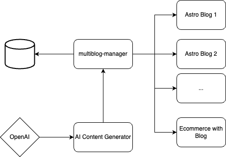

# Multiblog Manager

The Multiblog Manager is a Spring Boot application designed to manage multiple blogs efficiently. It provides a robust backend infrastructure for creating, managing, and serving content across various blog instances, all from a centralized system.

The Multiblog Manager architecture consists of the following components:

## Architecture

1. Multi-Blog Manager: The core Spring Boot application that handles the management of multiple blogs.
2. Database: A PostgreSQL database hosted on Railway, storing all blog and post data.
3. AI Content Generator: An OpenAI-powered service for generating blog content (future integration).
4. Blog Instances: Multiple blog front-ends that consume data from the Multiblog Manager.

## Project Goals

1. Centralized Blog Management: Create a single point of control for managing multiple blog instances.
2. Scalability: Design the system to easily accommodate new blog instances without significant backend changes.
3. RESTful API: Implement a well-structured RESTful API for seamless integration with various front-end applications.
4. Data Integrity: Ensure robust data management and integrity across all blog instances.
5. Performance Optimization: Implement efficient database queries and caching mechanisms for improved performance.
6. AI Integration: Prepare the system for future integration with AI-powered content generation tools.

## Key Features

1. CRUD operations for blogs and posts
2. Unique slugs for SEO-friendly URLs
3. Image URL and alt text support for posts
4. Efficient database schema design with PostgreSQL
5. Comprehensive error handling and logging
6. Unit and integration tests for reliability

## Technologies Used

- Java 21
- Spring Boot 3.3.2
- Spring Data JPA
- PostgreSQL
- Flyway for database migrations
- JUnit 5 for testing
- Gradle for build management

## Future Enhancements

- ~~Integration with OpenAI for AI-powered content generation~~
- ~~Implementation of user authentication and authorization~~
- Analytics dashboard for blog performance metrics
- ~~Content scheduling and publishing features~~
